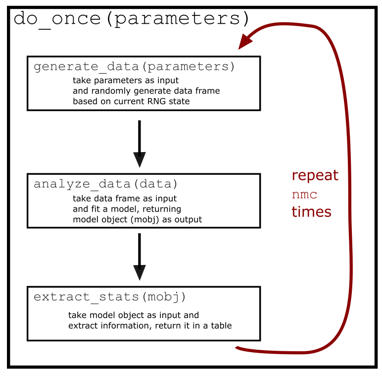

--- 
title: "Simulating power for mixed-effects models"
author: "Dale J. Barr"
date: "2023-11-29"
site: bookdown::bookdown_site
documentclass: book
bibliography: [refs.bib, packages.bib]
biblio-style: apa
csl: include/apa.csl
link-citations: yes
description: "Workshop at AMLaP Asia, November 30, 2023."
url: "https://dalejbarr.github.io/aa-powersim"
github-repo: "dalejbarr/basel-longitudinal"
---


# Workshop: Simulating power for mixed-effects models {-}

*Dale J. Barr*

**[AMLaP Asia](http://ling.cuhk.edu.hk/amlap.asia/), November 30, 2023**

## Background {-}

Materials for a practical one-day workshop aimed at conference attendees who are interested in utilizing linear mixed-effects models in their research. Led by Dr. Dale Barr from the University of Glasgow, this workshop provides an introduction to simulating power in linear mixed-effects models.

Two pre-requisites for the workshop are: (1) basic understanding of linear regression and (2) some familiarity with the R statistical programming environment (https://cran.r-project.org). Please have R and RStudio installed on your laptop prior to the start of the workshop, including the packages **`{tidyverse}`** and **`lme4`**. 

## Workshop plan {-}

- *Part 1* (9:00-12:00): **Building blocks of simulation**

  Provides an overview of critical programming skills for Monte Carlo simulation.

- *Part 2* (14:00-17:00): **Simulating power in linear mixed-effects models**

  Conceptual introduction to the data generating process (DGP) behind many models in psycholinguistics, and instructions on how to adapt the script generated in Part 1 to a multilevel context.

## Notes on these materials {-}

These materials comprise an **interactive textbook**. Each "chapter" contains embedded exercises as well as web applications to help participants better understand the content. The interactive content will only work if you access this material through a web browser. Printing out the material is not recommended. 

It would be good to keep a local copy of these materials in case the website eventually disappears. You can [download an offline version](amlap-asia-power-simulation.zip){target="_download"} of these materials. It contains the current snapshot. Because things are likely to change while the workshop is ongoing, it would be best to wait until the end of the workshop before downloading a permanent version.

Once you've downloaded the archive, just extract the files, locate the file `index.html` in the `docs` directory, and open this file using a web browser.

You are free to re-use and modify the material in this textbook for your own purposes, with the stipulation that you cite the original work. Please note additional terms of the [Creative Commons CC-BY-SA 4.0 license](https://creativecommons.org/licenses/by-sa/4.0/) governing re-use of this material.

The book was built using the R [**`bookdown`**](https://bookdown.org) package. The source files are available at [github](https://github.com/dalejbarr/aa-powersim).

## Found an issue? {-}

If you find errors or typos, have questions or suggestions, please file an issue at <https://github.com/dalejbarr/aa-powersim/issues>. Thanks!

<!--chapter:end:index.Rmd-->

# Building blocks of simulation

## Coding preliminaries

If the main thing you do when using R is analyzing data, then it is likely that you haven't been exposed to many of the features of R and the tidyverse that are needed for data simulation, including random number generation (\@ref(rng)), writing custom functions (\@ref(funcs)), iteration (\@ref(iterate)), nested tables (\@ref(nesting)), handling warnings and messages (\@ref(trapping)), and extracting statistics from model objects (\@ref(extract)).

We will start by providing a basic overview on each of these topics through the task of generating an R script that performs a power simulation for a one-sample t-test for various effect and sample sizes. Although there are analytical solutions for computing power for this type of test, it is worth learning the general principles before dealing with the complexities of linear mixed-effects models.

In what follows, I will assume that you are familiar with how "pipes" work in R (either the base pipe, `|>` or the dplyr pipe, `%>%`) and the following one-table verbs from dplyr: `select()`, `mutate()`, and `summarize()`.

### Setting up the environment

When you're developing an R script, it is good practice to load in the packages you need at the top of the script.


```r
suppressPackageStartupMessages({
  library("dplyr")  # select(), mutate(), summarize(), inner_join()
  library("tibble") # tibble() [data entry]
  library("purrr")  # just for map()
  library("tidyr")  # nest(), unnest()

  requireNamespace("broom") # don't load, just fail if it's not there
})
```

We have wrapped these calls in `suppressPackageStartupMessages()` so that when don't get any of the messages that come up when packages are loaded each time we run the script. We are just using tidyverse functions anyway, so there shouldn't be any problems.

### Random number generation {#rng}

Simulating data means simulating random processes. Usually the random process we are trying to mimic is that of **sampling**, i.e.,  drawing a (presumably random) sample from a population. 

This involves randomly generating numbers from some kind of statistical distribution. For many purposes we will use the univariate normal distribution via the function `rnorm()`, which is included in base R. If we want to simulate data from a multivariate normal distribution (which we will do in the next section), then we can use `MASS::mvrnorm()`.

The key arguments to `rnorm()` are:

|        |                                                     |
|--------|-----------------------------------------------------|
| `n`    | the number of observations we want                  |
| `mean` | the population mean of the distribution (default 0) |
| `sd`   | the population standard deviation (default 1)       |

**TASK: simulate 10 observations from a normal distribution with a mean of 0 and standard deviation of 5.**


<div class='webex-solution'><button>Solution</button>


rnorm(10, sd = 5)


</div>


Functions like `rnorm()` will give you random output based on the state of the internal random number generator (RNG). If we want to get a deterministic output, we can "seed" the random number generator using `set.seed()`. (Often it makes sense to do this once, at the top of a script.) The function `set.seed()` takes a single argument, which is an arbitrary integer value that provides the 'starting point'.

**TASK: set the seed to 1451 and then simulation 15 observations from a normal distribution with a mean of 600 and standard deviation of 80. If you do this right, your output should EXACTLY match the output below.**


```
##  [1] 383.2186 522.1162 503.1198 640.4056 628.0002 759.7153 595.5522 516.1018
##  [9] 479.3662 587.9051 775.4601 684.2209 671.1479 597.2221 618.4092
```


<div class='webex-solution'><button>Solution</button>


```r
set.seed(1451)

rnorm(15, mean = 600, sd = 80)
```


</div>


### Iterating using `purrr::map()` {#iterate}

To estimate power using simulation, we need to create our function and then run it many times—maybe 1,000 or 10,000 times to get a reliable estimate. Of course, we are not going to type a function call to do it that many times; it would be tedious, and besides, we might make mistakes. What we need is something to do the iteration for us, possible changing the input to our function each time.

In many programming languages, this is accomplished by writing a "for" loop. This is possible in R as well, but we're going to do this a different way which saves typing.

We are going to use the function `purrr::map()`. Let's look at an example. Suppose we had a vector of integers, `x`, and wanted to compute the logarithm (`log()`) of each one. If we didn't know about `map()`, we might type the following.


```r
x <- c(1L, 4L, 7L, 9L, 14L) # the 'L' after each number means "long integer"

log(x[1])
log(x[2])
log(x[3])
log(x[4])
log(x[5])
```

```
## [1] 0
## [1] 1.386294
## [1] 1.94591
## [1] 2.197225
## [1] 2.639057
```

That's a lot of typing. With `map()`, we can just type this.


```r
map(x, log)
```

```
## [[1]]
## [1] 0
## 
## [[2]]
## [1] 1.386294
## 
## [[3]]
## [1] 1.94591
## 
## [[4]]
## [1] 2.197225
## 
## [[5]]
## [1] 2.639057
```

Note that the output comes in the form of a list. If we wanted the output to be a vector of doubles, we could use `map_dbl()` instead.


```r
map_dbl(x, log)
```

```
## [1] 0.000000 1.386294 1.945910 2.197225 2.639057
```

Now, by default, `log()` gives the natural logarithm (using base $e$, Euler's number). What if we want to change the base? To do that we'd have to pass an additional argument `base = 2` to log within map. We could add that like so


```r
map_dbl(x, log, base = 2)
```

```
## [1] 0.000000 2.000000 2.807355 3.169925 3.807355
```

But now it's unclear... is `base = 2` an argument to `map_dbl()`, or to `log()`? (Well, it's both). This makes things needlessly hard to debug. So the recommended way to do this is to call `log()` within `map()` as part of an anonymous function.


```r
map_dbl(x, \(.x) log(.x, base = 2))
```

```
## [1] 0.000000 2.000000 2.807355 3.169925 3.807355
```

This allows us to call `log()` in the "normal" way (i.e., the way we would do it if typing in the console. The `\(.x)` says to R "pass along the value from `x` you're currently working with to the function on the right hand side, giving this new value `.x`". Also, making explicit the passing of the value from `map()` to the function you wish to repeat makes it easy to work with situations where the varying value is not the first argument of that function.

If you have multiple arguments you need to pass to the function, you can do this using `purrr::pmap()`, whose first argument takes a list of function arguments. 

For a deep dive into the topic of iteration, see <https://TODO>.

**TASK: Write a call to `map_dbl()` that calculates the log of 3 but with bases varying from 2 to 7.**


<div class='webex-solution'><button>Solution</button>


```r
map_dbl(2:7, \(.x) log(3, base = .x))
```

```
## [1] 1.5849625 1.0000000 0.7924813 0.6826062 0.6131472 0.5645750
```


</div>


### Creating "tibbles"

Much of what we'll be doing will involve working with datasets stored in tables, or **tabular data** (in R, a table is also called a `data.frame`). When you're analyzing data, you usually create these tables by importing data from a file (e.g., a CSV or Excel file with experiment data).

When you're simulating data, you need to create these tables yourself. The `tibble` package has functions that help make this easier. For current purposes, really the only function we need from this package is `tibble::tibble()`, which is an enhanced version of the base R `data.frame()` for manual data entry.

Let's assume we're creating information about the participants in a study. Each participant is given a unique `id` and we have recorded information about their age. We can enter this into a tibble() like so.


```r
participants <- tibble(id = c(1L, 2L, 3L, 4L, 5L),
                       age = c(27L, 18L, 43L, 72L, 21L))

participants
```

```
## # A tibble: 5 × 2
##      id   age
##   <int> <int>
## 1     1    27
## 2     2    18
## 3     3    43
## 4     4    72
## 5     5    21
```

#### Save typing with `rep()`, `seq()`, and `seq_len()`

Let's now say you are going to run these participants on a [Stroop interference task](https://TODO) where they see color words printed in congruent or incongruent colors (e.g., the word "RED" printed in red font or green font) and have to name the color of the font. Let's assume that each person gets each word twice, once in the congruent condition and once in the incongruent condition. Now you want to make a table that has each of the six colors in each condition. The resulting table should look like this.


We could type all that out manually but it would be tedious and prone to typos. Fortunately R has a function `rep()` that allows us to repeat values. Study the code below. until you understand how it works.


```r
rep(1:4, each = 3)
```

```
##  [1] 1 1 1 2 2 2 3 3 3 4 4 4
```


```r
rep(5:7, times = 4)
```

```
##  [1] 5 6 7 5 6 7 5 6 7 5 6 7
```


```r
rep(8:10, c(2, 3, 0))
```

```
## [1] 8 8 9 9 9
```

**TASK: Write code to recreate the Stroop stimuli table shown above using `rep()` to define the column values. Name the resulting table `stimuli`.**


<div class='webex-solution'><button>Solution</button>


```r
stimuli <- tibble(word = rep(c("red", "green", "blue", "yellow",
                               "purple", "orange"), each = 2),
                  cond = rep(c("congruent", "incongruent"), times = 6))
```


</div>


Two other functions that are useful in simulation are `seq_len()` and `seq()`. Examples of these are below.


```r
## sequence of integers 1:length.out;
## if length.out == 0 then 'empty'
seq_len(length.out = 4)
```

```
## [1] 1 2 3 4
```


```r
seq(from = 2, to = 7, by = .5)
```

```
##  [1] 2.0 2.5 3.0 3.5 4.0 4.5 5.0 5.5 6.0 6.5 7.0
```


```r
seq(from = 2, to = 7, length.out = 5)
```

```
## [1] 2.00 3.25 4.50 5.75 7.00
```

#### Nested tibbles {#nesting}

Tibbles, like the `data.frame` class from which they are derived, are just specialized list structures. Lists are useful as data structures because unlike vectors, each element can be of a different data type (character, integer, double, factor). To be data frames, however, it is essential that each list element has the same length (number of elements).

A great feature of tibbles that differs from `data.frame` objects is that they can have columns whose values are themselves... tibbles. That is, we can have tibbles inside of tibbles, but we have to define those columns using the `list()` function.


```r
beatles <- tibble(name = c("John", "Paul", "Ringo", "George"),
                  instrument = c("guitar", "bass", "drums", "guitar"))

rolling_stones <- tibble(name = c("Keith", "Mick", "Charlie", "Bill"),
                         instrument = c("guitar", "vocals", "drums", "bass"))

boomer_bands <- tibble(band_name = c("Beatles", "Rolling Stones"),
                       band_members = list(beatles, rolling_stones))

boomer_bands
```

```
## # A tibble: 2 × 2
##   band_name      band_members    
##   <chr>          <list>          
## 1 Beatles        <tibble [4 × 2]>
## 2 Rolling Stones <tibble [4 × 2]>
```

And if we then wanted to "expand" these nested tables we can do so using `tidyr::unnest()`.


```r
bb2 <- boomer_bands |>
  unnest(band_members)

bb2
```

```
## # A tibble: 8 × 3
##   band_name      name    instrument
##   <chr>          <chr>   <chr>     
## 1 Beatles        John    guitar    
## 2 Beatles        Paul    bass      
## 3 Beatles        Ringo   drums     
## 4 Beatles        George  guitar    
## 5 Rolling Stones Keith   guitar    
## 6 Rolling Stones Mick    vocals    
## 7 Rolling Stones Charlie drums     
## 8 Rolling Stones Bill    bass
```

And if we wanted to, we can then reverse the operation.


```r
bb2 |>
  nest(band_members = c(name, instrument))
```

```
## # A tibble: 2 × 2
##   band_name      band_members    
##   <chr>          <list>          
## 1 Beatles        <tibble [4 × 2]>
## 2 Rolling Stones <tibble [4 × 2]>
```

Why is this useful? Well, mostly because it elegantly allows us to account for the multilevel structure of data, such as when you have trials nested within participants. But we'll see shortly how we can combine this with `map()` (which returns a list) to make columns whose elements are tibbles of simulated data, or analyses performed on those tibbles.

### Combining tibbles

Often you'll end up with data scattered across different tables and need to merge it into a single table. The tidyverse provides powerful and efficient functions for merging data.

#### Cartesian join with `dplyr::cross_join()`

Occasionally what we want to do is combine all possible combinations of rows across two tables, in what is known as a "Cartesian join." For this, we can use the function `dplyr::cross_join()`. This is easiest to explain by an example.


```r
some_letters <- tibble(letter = c("A", "B", "C"))

some_numbers <- tibble(numbers = seq_len(3))

cross_join(some_letters, some_numbers)
```

```
## # A tibble: 9 × 2
##   letter numbers
##   <chr>    <int>
## 1 A            1
## 2 A            2
## 3 A            3
## 4 B            1
## 5 B            2
## 6 B            3
## 7 C            1
## 8 C            2
## 9 C            3
```

**TASK: Above, we created the table `participants` and `stimuli`. Combine these two tables to create a table `trials` which creates all the possible trials in an experiment where each participant sees each stimulus once. The resulting table should have 60 rows, but don't include 'age' in the output.**


```r
trials <- cross_join(participants |> select(id),
                     stimuli)

trials
```

```
## # A tibble: 60 × 3
##       id word   cond       
##    <int> <chr>  <chr>      
##  1     1 red    congruent  
##  2     1 red    incongruent
##  3     1 green  congruent  
##  4     1 green  incongruent
##  5     1 blue   congruent  
##  6     1 blue   incongruent
##  7     1 yellow congruent  
##  8     1 yellow incongruent
##  9     1 purple congruent  
## 10     1 purple incongruent
## # ℹ 50 more rows
```

#### Inner join with `dplyr::inner_join()`

Sometimes what you need to do is combine information from two tables but you don't want all possible combinations; rather, you want to keep the rows from both tables that match on certain 'key' values.

For example, in the `participants` table we have each participant's age. If we wanted to combine that information with the information in `trials` (e.g., in order to analyze Stroop interference across age), then we'd need a way to get the `age` variable into `trials`. For this we can use an `inner_join()`, specifying the `key` column in the `by` argument to the function.


```r
participants |>
  inner_join(trials, by = join_by(id))
```

```
## # A tibble: 60 × 4
##       id   age word   cond       
##    <int> <int> <chr>  <chr>      
##  1     1    27 red    congruent  
##  2     1    27 red    incongruent
##  3     1    27 green  congruent  
##  4     1    27 green  incongruent
##  5     1    27 blue   congruent  
##  6     1    27 blue   incongruent
##  7     1    27 yellow congruent  
##  8     1    27 yellow incongruent
##  9     1    27 purple congruent  
## 10     1    27 purple incongruent
## # ℹ 50 more rows
```

### Writing custom functions {#funcs}

## Power simulation: Basic workflow

<div class="figure" style="text-align: center">

<p class="caption">(\#fig:flow-img)The basic workflow behind power simulation.</p>
</div>

Now that we've gone over the programming basics, we are ready to start building a script to simulate power for a one-sample test. Figure \@ref(fig-flow-img) presents the basic workflow.

### Simulating a dataset

The first thing to do is to write (and test) a function `generate_data()` that takes population parameters and sample size info as input and creates simulated data as output using `rnorm()`.

**TASK: write a function `generate_data()` that takes three arguments as input: `eff` (the population intercept parameter), `nsubj` (number of subjects), and `sd` (the standard deviation, which should default to 1). The resulting table should have two columns, `subj_id` and `dv` (dependent variable; i.e., the result from `rnorm()`).**

To test your function, run the code below and see if the output matches exactly.


```r
set.seed(1451)

generate_data(5, 10, 2)
```

```
## # A tibble: 10 × 2
##    subj_id     dv
##      <int>  <dbl>
##  1       1 -0.420
##  2       2  3.05 
##  3       3  2.58 
##  4       4  6.01 
##  5       5  5.70 
##  6       6  8.99 
##  7       7  4.89 
##  8       8  2.90 
##  9       9  1.98 
## 10      10  4.70
```


<div class='webex-solution'><button>Solution</button>


```r
generate_data <- function(eff, nsubj, sd = 1) {
  tibble(subj_id = seq_len(nsubj),
         dv = rnorm(nsubj, mean = eff, sd = sd))
}
```


</div>


### Analyzing the data

Unlike conventional statistical techniques (t-test, ANOVA), linear-mixed effects models are estimated iteratively and may not converge, or may yield estimates of covariance matrices that are "singular" (i.e., can be expressed in lower dimensionality). We will track statistics about singularity / nonconvergence in our simulations, but the repeated messages and warnings can be annoying when they are running, so we need to 'suppress' them. Now, for our simple one-sample power simulation we don't have to deal with these, but we are here to learn, so let's create a function that randomly throws warnings (20% of the time) and messages (20% of the time) so we can learn how to deal with them.

We will name this function `annoy_user()` and will embed it in our analysis function to simulation the messages we will get once we move to linear mixed-effects modeling.


```r
annoy_user <- function() {
  ## randomly throw messages (20%) or warnings (20%) to annoy the user
  ## like a linear mixed-effects model
  x <- sample(1:5, 1) # roll a five-sided die...
  if (x == 1L) {
    warning("Winter is coming.")
  } else if (x == 2L) {
    message("Approaching the singularity.")
  } # otherwise do nothing
  invisible(NULL) ## return NULL invisibly
}
```

Now we're ready to write our analysis function. We'll include `annoy_user()` as part of this function.

**TASK: use the starter code below to develop your analysis function for a one-sample test (hint: `t.test()`). The function should return the full 'data object' output from the t-test function.**


```r
analyze_data <- function(dat) {
  annoy_user()
  ## TODO add in your analysis here
}
```


```r
set.seed(1451)

generate_data(0, 10) |>
  analyze_data()
```

```
## 
## 	One Sample t-test
## 
## data:  pull(dat, dv)
## t = -0.78487, df = 9, p-value = 0.4527
## alternative hypothesis: true mean is not equal to 0
## 95 percent confidence interval:
##  -1.1935688  0.5786762
## sample estimates:
##  mean of x 
## -0.3074463
```


<div class='webex-solution'><button>Solution</button>


```r
analyze_data <- function(dat) {
  annoy_user()
  dat |>
    pull(dv) |>
    t.test()
}
```

Note that `dat |> pull(dv)` is the tidyverse way of extracting a column from a data frame.


</div>


#### Handling warnings and messages {#trapping}

OK, if we run `generate_data() |> analyze_data()` a bunch of times, it's going to occasionally give us bothersome warnings and messages.


```r
result <- 1:20 |>
  map(\(.x) generate_data(0, 10) |> analyze_data())
```

```
## Warning in annoy_user(): Winter is coming.
```

```
## Approaching the singularity.
```

```
## Warning in annoy_user(): Winter is coming.

## Warning in annoy_user(): Winter is coming.

## Warning in annoy_user(): Winter is coming.

## Warning in annoy_user(): Winter is coming.
```

```
## Approaching the singularity.
```

We have two options here: we can *trap* them if we want to react in some way when they occur; or, we can *suppress* them so that they don't clutter up the output when the model is running. Since there are ways to check convergence / singularity after the fact, we'll opt for suppression. Fortunately R has the functions `suppressMessages()` and `suppressWarnings()`, and all we have to do is wrap them around our code. So, our final analysis function will be as follows.


```r
analyze_data <- function(dat) {
  suppressWarnings(
    suppressMessages({
      annoy_user()
      dat |>
        pull(dv) |>
        t.test()
    }))
}
```

Let's try it again.


```r
result <- 1:20 |>
  map(\(.x) generate_data(0, 10) |> analyze_data())
```

For future reference, in cases where you would want to trap an error/message/warning, you would use the `tryCatch()` function instead. See <https://adv-r.hadley.nz/conditions.html> if you want a deep dive into the topic of condition handling.

### Extracting statistics {#extract}

The output of `t.test()` gives us a data object, but it would be better if we could extract all the relevant stats in the form of a table. We want a function that takes a statistical data object (or fitted model object, `mobj`) and return a table with statistical information. This is where `broom::tidy()` comes to the rescue. 

Unfortunately this function won't work for linear mixed-effects models, so we'll have to extract what we need in other ways when we get there. But we'll just use `broom::tidy()` for now.


```r
extract_stats <- function(mobj) {
  mobj |>
    broom::tidy()
}
```

We call `tidy()` using `broom::tidy()` because we didn't load the package. Generally if you just need a single package function it's a good idea not to load it, to avoid possible namespace clashes.

### Wrapping it all in a single function

Now we've completed the three functions shown in Figure \@ref(fig-flow-img), and can string them together.


```r
generate_data(0, 10) |>
  analyze_data() |>
  extract_stats()
```

```
## # A tibble: 1 × 8
##   estimate statistic p.value parameter conf.low conf.high method     alternative
##      <dbl>     <dbl>   <dbl>     <dbl>    <dbl>     <dbl> <chr>      <chr>      
## 1   -0.360     -1.24   0.246         9    -1.01     0.295 One Sampl… two.sided
```

We want to do this many times. The way we'll approach this is to create a tibble where each row has the generated data, the model object, and the statistics from a single run.

Here's code to create a tibble with `run_id` (to identify each row) and a list-column `dat`, each element of which contains simulated data.


```r
nmc <- 20L # number of Monte Carlo runs

result <- tibble(run_id = seq_len(nmc),
                 dat = map(run_id, \(.x) generate_data(0, 10)))
```

**TASK: Update the code above to add two additional rows, `mobj` (a list-column) which has the result of applying `analyze_data()` to each generated dataset, and `stats` (a list-column) which has the result of applying `extract_stats()` to each element `mobj`.**


The table `result` should look as follows.


```
## # A tibble: 20 × 4
##    run_id dat               mobj    stats           
##     <int> <list>            <list>  <list>          
##  1      1 <tibble [10 × 2]> <htest> <tibble [1 × 8]>
##  2      2 <tibble [10 × 2]> <htest> <tibble [1 × 8]>
##  3      3 <tibble [10 × 2]> <htest> <tibble [1 × 8]>
##  4      4 <tibble [10 × 2]> <htest> <tibble [1 × 8]>
##  5      5 <tibble [10 × 2]> <htest> <tibble [1 × 8]>
##  6      6 <tibble [10 × 2]> <htest> <tibble [1 × 8]>
##  7      7 <tibble [10 × 2]> <htest> <tibble [1 × 8]>
##  8      8 <tibble [10 × 2]> <htest> <tibble [1 × 8]>
##  9      9 <tibble [10 × 2]> <htest> <tibble [1 × 8]>
## 10     10 <tibble [10 × 2]> <htest> <tibble [1 × 8]>
## 11     11 <tibble [10 × 2]> <htest> <tibble [1 × 8]>
## 12     12 <tibble [10 × 2]> <htest> <tibble [1 × 8]>
## 13     13 <tibble [10 × 2]> <htest> <tibble [1 × 8]>
## 14     14 <tibble [10 × 2]> <htest> <tibble [1 × 8]>
## 15     15 <tibble [10 × 2]> <htest> <tibble [1 × 8]>
## 16     16 <tibble [10 × 2]> <htest> <tibble [1 × 8]>
## 17     17 <tibble [10 × 2]> <htest> <tibble [1 × 8]>
## 18     18 <tibble [10 × 2]> <htest> <tibble [1 × 8]>
## 19     19 <tibble [10 × 2]> <htest> <tibble [1 × 8]>
## 20     20 <tibble [10 × 2]> <htest> <tibble [1 × 8]>
```


<div class='webex-solution'><button>Solution</button>


```r
nmc <- 20L # number of Monte Carlo runs

result <- tibble(run_id = seq_len(nmc),
                 dat = map(run_id, \(.x) generate_data(0, 10)),
                 mobj = map(dat, \(.x) analyze_data(.x)),
                 stats = map(mobj, \(.x) extract_stats(.x)))
```


</div>


#### Calculating power

We're getting so close! Now what we need to do is compute power based on the statistics we have calculated (in the `stats`) column. We can extract these using `select()` and `unnest()` like so.


```r
result |>
  select(run_id, stats) |>
  unnest(stats)
```

```
## # A tibble: 20 × 9
##    run_id estimate statistic  p.value parameter conf.low conf.high method       
##     <int>    <dbl>     <dbl>    <dbl>     <dbl>    <dbl>     <dbl> <chr>        
##  1      1  -0.338     -1.20  0.260            9   -0.974     0.298 One Sample t…
##  2      2   0.482      1.74  0.115            9   -0.144     1.11  One Sample t…
##  3      3  -0.258     -1.16  0.274            9   -0.761     0.244 One Sample t…
##  4      4  -0.113     -0.491 0.635            9   -0.632     0.407 One Sample t…
##  5      5  -0.447     -1.61  0.143            9   -1.08      0.183 One Sample t…
##  6      6   0.0683     0.209 0.839            9   -0.669     0.806 One Sample t…
##  7      7   0.264      0.810 0.439            9   -0.473     1.00  One Sample t…
##  8      8  -0.622     -1.86  0.0959           9   -1.38      0.135 One Sample t…
##  9      9  -0.0249    -0.106 0.918            9   -0.555     0.505 One Sample t…
## 10     10  -0.139     -0.536 0.605            9   -0.728     0.449 One Sample t…
## 11     11  -0.597     -2.97  0.0157           9   -1.05     -0.143 One Sample t…
## 12     12   0.172      0.533 0.607            9   -0.556     0.899 One Sample t…
## 13     13   0.449      1.28  0.232            9   -0.343     1.24  One Sample t…
## 14     14  -0.218     -1.04  0.324            9   -0.691     0.254 One Sample t…
## 15     15  -0.478     -1.43  0.187            9   -1.23      0.279 One Sample t…
## 16     16  -0.305     -0.808 0.440            9   -1.16      0.549 One Sample t…
## 17     17  -0.627     -1.54  0.158            9   -1.55      0.295 One Sample t…
## 18     18   0.111      0.390 0.706            9   -0.532     0.753 One Sample t…
## 19     19  -0.762     -5.60  0.000335         9   -1.07     -0.454 One Sample t…
## 20     20  -0.122     -0.480 0.642            9   -0.697     0.453 One Sample t…
## # ℹ 1 more variable: alternative <chr>
```

Now adapt the above code into a function `compute_power()` that takes a table `x` (e.g., `result`) as input along with the `alpha` level (defaulting to .05) and returns power as a table with `nsig` (number of significant runs), `N` (total runs), `power` (proportion of runs that were significant).


<div class='webex-solution'><button>Hint</button>


You got `p.value` as a column after unnesting.

`p.value < alpha` will compare each p value to alpha and return `TRUE` if it is statistically significant, false otherwise.

Do something with `summarize()` to calculate the number of runs that were significant.


</div>


<div class='webex-solution'><button>Solution</button>


```r
compute_power <- function(x, alpha = .05) {
  x |>
    select(stats) |>
    unnest(stats) |>
    summarize(nsig = sum(p.value < alpha),
              N = n(),
              power = nsig / N)
}
```


</div>


Let's combine all the code into a single function, `do_once()`, that we can run in batch mode as well as interactively, and that goes all the way from from `generate_data()` to `compute_power()`.

**TASK: Let's wrap the above code in a function `do_once()`. This function should accept as input `nmc` (number of Monte Carlo runs), `eff` (effect size), `nsubj` (number of subjects), `sd` (standard deviation), and alpha level `alpha` that defaults to .05. The function should return the results of `compute_power()`.**


Once complete, test it using the code below. Your output should be identical.


```r
set.seed(1451)

do_once(nmc = 1000, eff = 0, nsubj = 20, sd = 1, alpha = .05)
```

```
## # A tibble: 1 × 3
##    nsig     N power
##   <int> <int> <dbl>
## 1    47  1000 0.047
```


<div class='webex-solution'><button>Solution</button>


```r
do_once <- function(nmc, eff, nsubj, sd, alpha = .05) {
  tibble(run_id = seq_len(nmc),
         dat = map(run_id, \(.x) generate_data(eff, nsubj, sd)),
         mobj = map(dat, \(.x) analyze_data(.x)),
         stats = map(mobj, \(.x) extract_stats(.x))) |>
    compute_power(alpha)
}
```


</div>


OK, now that you've got this far, you should take a step back and celebrate that you have a function, `do_once()`, that runs a power simulation given the population parameters, alpha level, and sample size as user input. 

### Calculating power curves

So, we've now calculated a power curve for a *single parameter setting*. But we usually want to calculate a power *curve* so that we can see how power varies as a function of some parameter (usually, effect size and sample size). How can we do that?

Well, given that we've encapulated the guts of our simulation in a single function, it is a simple matter of just calling that function repeatedly with different inputs and storing the results. Sound familiar?

**TASK: Create a tibble with parameter values for `eff` (effect size) going in 5 steps from zero to 1.5. The tibble should have a column `pow`, which has the results from `do_once()` called for that value of `eff` (and with `nsubj`, `sd`, and `nmc` held constant at `20`, `1`, and `100` respectively).**

If you set the seed to 1451 before you run it, then print it out, the resulting table should look like this.


```
## # A tibble: 5 × 4
##     eff  nsig     N power
##   <dbl> <int> <int> <dbl>
## 1   0       7   100  0.07
## 2   0.3    29   100  0.29
## 3   0.6    73   100  0.73
## 4   0.9    98   100  0.98
## 5   1.2   100   100  1
```


<div class='webex-solution'><button>Solution</button>


```r
pow_result <- tibble(eff = seq(0, 1.2, length.out = 5),
                     pow = map(eff, \(.x) do_once(100, .x, 20, 1))) |>
  unnest(pow)
```


</div>


## The full script

Running power simulations can take a long time. We surely want to save the results when we're done, and probably make it reproducible by setting the seed before calling any functions. But that's it! We now have a self-contained, reproducible script for calculating power.


<div class='webex-solution'><button>See the full script</button>


```r
#############################
## ADD-ON PACKAGES

suppressPackageStartupMessages({
  library("dplyr")  # select(), mutate(), summarize(), inner_join()
  library("tibble") # tibble() [data entry]
  library("purrr")  # just for map()
  library("tidyr")  # nest(), unnest()

  requireNamespace("broom") # don't load, just fail if it's not there
})


#############################
## MAIN FUNCTIONS

generate_data <- function(eff, nsubj, sd = 1) {
  tibble(subj_id = seq_len(nsubj),
         dv = rnorm(nsubj, mean = eff, sd = sd))
}

analyze_data <- function(dat) {
  suppressWarnings(
    suppressMessages({
      annoy_user()
      dat |>
        pull(dv) |>
        t.test()
    }))
}

extract_stats <- function(mobj) {
  mobj |>
    broom::tidy()
}

#############################
## UTILITY FUNCTIONS

compute_power <- function(x, alpha = .05) {
  x |>
    select(stats) |>
    unnest(stats) |>
    summarize(nsig = sum(p.value < alpha),
              N = n(),
              power = nsig / N)
}

do_once <- function(nmc, eff, nsubj, sd, alpha = .05) {
  tibble(run_id = seq_len(nmc),
         dat = map(run_id, \(.x) generate_data(eff, nsubj, sd)),
         mobj = map(dat, \(.x) analyze_data(.x)),
         stats = map(mobj, \(.x) extract_stats(.x))) |>
    compute_power(alpha)
}

#############################
## MAIN PROCEDURE

pow_result <- tibble(eff = seq(0, 1.2, length.out = 5),
                     pow = map(eff, \(.x) do_once(100, .x, 20, 1))) |>
  unnest(pow)

outfile <- "simulation-results-one-sample.rds"

saveRDS(pow_result, file = outfile)
message("saved results to '", ofile, "'")
```


</div>


<!--chapter:end:01_building-blocks.Rmd-->

# Linear mixed-effects modeling

For this first section, we will learn to simulate data corresponding to an experiment with a single, two-level factor (independent variable) that is within-subjects and between-items.  Let's imagine that the experiment involves lexical decisions to a set of words (e.g., is "PINT" a word or nonword?), and the dependent variable is response time (in milliseconds), and the independent variable is word type (noun vs verb).  We want to treat both subjects and words as random factors (so that we can generalize to the population of events where subjects encounter words).

The general linear model for our study is:

$$Y_{si} = \beta_0 + S_{0s} + I_{0i} + (\beta_1 + S_{1s})X_{i} + e_{si}$$

where:

|           |       |                                                   |
|-----------|-------|---------------------------------------------------|
| $Y_{si}$  | `Y`   | RT for subject $s$ responding to item $i$;        |
| $\beta_0$ | `mu`  | grand mean;                                       |
| $S_{0s}$  | `sri` | random intercept for subject $s$;                 |
| $I_{0i}$  | `iri` | random intercept for item $i$;                    |
| $\beta_1$ | `eff` | fixed effect of word type (slope);                |
| $S_{1s}$  | `srs` | by-subject random slope;                          |
| $X_{i}$   | `x`   | deviation-coded predictor variable for word type; |
| $e_{si}$  | `err` | residual error.                                   |

**Subjects**

$$\left<S_{0i},S_{1i}\right> \sim N(\left<0,0\right>, \Sigma)$$

where

$$\Sigma = \left(\begin{array}{cc}{\tau_{00}}^2 & \rho\tau_{00}\tau_{11} \\ \rho\tau_{00}\tau_{11} & {\tau_{11}}^2 \\ \end{array}\right) $$

**Items**

$$I_{0i} \sim N(0, \omega_{00}^2)$$

## Generate data

### Set up the environment 

If you want to get the same results as everyone else for this exercise, then we all should seed the random number generator with the same value.  While we're at it, let's load in the packages we need.


```r
library("lme4")
library("tidyverse")
requireNamespace("MASS") ## make sure it's there but don't load it

set.seed(1451)
```

### Define the parameters for the DGP {#dgp}

Now let's define the parameters for the DGP (data generating process).


```r
nsubj <- 100 # number of subjects
nitem <- 50  # must be an even number

mu <- 800 # grand mean
eff <- 80 # 80 ms difference

iri_sd <- 80 # by-item random intercept sd (omega_00)

## for the by-subjects variance-covariance matrix
sri_sd <- 100 # by-subject random intercept sd
srs_sd <- 40 # by-subject random slope sd
rcor <- .2 # correlation between intercept and slope

err_sd <- 200 # residual (standard deviation)
```

You'll create three tables:

|            |                                                                      |
|------------|----------------------------------------------------------------------|
| `subjects` | table of subject data including `subj_id` and subject random effects |
| `items`    | table of stimulus data including `item_id` and item random effect    |
| `trials`   | table of trials enumerating encounters between subjects/stimuli      |

Then you will merge together the information in the three tables, and calculate the response variable according to the model formula above.

### Generate a sample of stimuli

Let's randomly generate our 50 items. Create a tibble called `item` like the one below, where `iri` are the by-item random intercepts (drawn from a normal distribution with variance $\omega_{00}^2$ = `iri_sd^2`).  Half of the words are of type NOUN (`cond` = -.5) and half of type VERB (`cond` = .5).


```
## # A tibble: 50 × 3
##    item_id  cond     iri
##      <int> <dbl>   <dbl>
##  1       1  -0.5 -217.  
##  2       2   0.5  -77.9 
##  3       3  -0.5  -96.9 
##  4       4   0.5   40.4 
##  5       5  -0.5   28.0 
##  6       6   0.5  160.  
##  7       7  -0.5   -4.45
##  8       8   0.5  -83.9 
##  9       9  -0.5 -121.  
## 10      10   0.5  -12.1 
## # ℹ 40 more rows
```


<div class='webex-solution'><button>Hint (cond)</button>


`rep()`


</div>


<div class='webex-solution'><button>Hint (iri)</button>


`rnorm(nitem, ???, ????...)`


</div>


<div class='webex-solution'><button>Solution</button>


```r
items <- tibble(item_id = 1:nitem,
                cond = rep(c(-.5, .5), times = nitem / 2),
                iri = rnorm(nitem, 0, sd = iri_sd))
```


</div>


### Generate a sample of subjects

To generate the by-subject random effects, you will need to generate data from a *bivariate normal distribution*.  To do this, we will use the function `MASS::mvrnorm()`.

::: {.warning}

Do not run `library("MASS")` just to get this one function, because `MASS` has a function `select()` that will overwrite the tidyverse version. Since all we want from MASS is the `mvrnorm()` function, we can just access it directly by the `pkgname::function` syntax, i.e., `MASS::mvrnorm()`.

:::

Here is an example of how to use `MASS::mvrnorm()` to randomly generate correlated data (with $r = -.6$) for a simple bivariate case. In this example, the variances of each of the two variables is defined as 1, such that the covariance becomes equal to the correlation between the variables.


```r
## mx is the variance-covariance matrix
mx <- rbind(c(1, -.6),
            c(-.6, 1))

biv_data <- MASS::mvrnorm(1000,
                          mu = c(V1 = 0, V2 = 0),
                          Sigma = mx)

## look at biv_data
ggplot(as_tibble(biv_data), aes(V1, V2)) +
  geom_point()
```


Your subjects table should look like this:


<div class='webex-solution'><button>Click to reveal full table</button>


```
## # A tibble: 100 × 3
##     subj_id      sri      srs
##       <int>    <dbl>    <dbl>
##   1       1   42.9    25.7   
##   2       2  -15.3   -28.2   
##   3       3  -41.4   -30.3   
##   4       4  -77.1     3.64  
##   5       5  182.      2.48  
##   6       6   24.6   -13.3   
##   7       7    8.92   42.8   
##   8       8 -101.    -37.2   
##   9       9  -96.8   -32.7   
##  10      10  -27.4   -52.6   
##  11      11  -80.8    -9.06  
##  12      12   83.8   -40.3   
##  13      13  134.    -18.9   
##  14      14 -130.    132.    
##  15      15  -59.2    -8.42  
##  16      16 -127.     12.5   
##  17      17    8.91  -15.3   
##  18      18  -26.8   -19.0   
##  19      19   48.0    39.5   
##  20      20   35.6    28.5   
##  21      21 -199.    -32.9   
##  22      22  -41.1    -9.77  
##  23      23  -29.9     1.02  
##  24      24   12.0   -24.0   
##  25      25   20.5     0.0251
##  26      26   -0.207  47.9   
##  27      27  -13.7   -77.8   
##  28      28 -154.     31.5   
##  29      29  -59.6    67.7   
##  30      30  -50.6   -27.6   
##  31      31  125.      9.51  
##  32      32  111.     13.4   
##  33      33  -27.0    71.7   
##  34      34 -140.     -7.69  
##  35      35  -31.0    18.4   
##  36      36 -185.     31.4   
##  37      37   12.8   -65.8   
##  38      38  -39.7   -51.6   
##  39      39  -93.9    76.3   
##  40      40  -63.9   -12.5   
##  41      41   68.6    -3.47  
##  42      42  -91.9   -31.8   
##  43      43 -143.     53.9   
##  44      44   44.6    48.0   
##  45      45    5.72   24.2   
##  46      46   51.3   101.    
##  47      47 -176.    -47.8   
##  48      48  -54.0   -23.8   
##  49      49   26.8    32.3   
##  50      50   20.4    -9.41  
##  51      51  122.     -2.03  
##  52      52 -111.    -16.1   
##  53      53  266.     16.4   
##  54      54  -42.1    -6.37  
##  55      55   -3.47  -30.1   
##  56      56   94.9    18.0   
##  57      57  -26.9   -19.9   
##  58      58  154.     43.0   
##  59      59  110.    -18.9   
##  60      60 -167.    -14.9   
##  61      61 -255.     -1.70  
##  62      62   95.9   -28.8   
##  63      63  211.    -78.7   
##  64      64  -40.7   102.    
##  65      65 -174.     -1.30  
##  66      66   42.3    11.0   
##  67      67 -120.    -94.1   
##  68      68 -173.     10.0   
##  69      69 -239.     -7.33  
##  70      70   28.8   -29.9   
##  71      71  107.     13.1   
##  72      72 -114.     -3.12  
##  73      73 -114.     20.7   
##  74      74  -23.5   -29.4   
##  75      75  -77.5    23.9   
##  76      76  160.     78.6   
##  77      77 -139.     40.6   
##  78      78   88.2    31.3   
##  79      79   -2.36  -24.1   
##  80      80    6.12    6.91  
##  81      81  -10.8   -47.2   
##  82      82   97.5    48.6   
##  83      83   38.4     5.61  
##  84      84    7.07  -42.2   
##  85      85   81.2    17.9   
##  86      86   52.8    80.4   
##  87      87  -78.4    16.8   
##  88      88 -116.     36.9   
##  89      89  -88.6    18.4   
##  90      90  -36.9   -12.9   
##  91      91 -100.    -21.8   
##  92      92 -114.    -18.9   
##  93      93   25.9   -45.2   
##  94      94  173.     52.7   
##  95      95   18.0   -68.1   
##  96      96 -112.     43.9   
##  97      97   20.9    -2.86  
##  98      98  169.     -2.79  
##  99      99 -101.     -3.88  
## 100     100  106.    -27.6
```


</div>


<div class='webex-solution'><button>Hint 1</button>


recall that:

|          |                                                |
|----------|------------------------------------------------|
| `sri_sd` | by-subject random intercept standard deviation |
| `srs_sd` | by-subject random slope standard deviation     |
| `r`      | correlation between intercept and slope        |


</div>


<div class='webex-solution'><button>Hint 2 (covariance)</button>


```
covariance = r * sri_sd * srs_sd
```


</div>


<div class='webex-solution'><button>Hint 3 (building a matrix)</button>


```r
## bind together rows
rbind(
  c(sri_sd^2,            r * sri_sd * srs_sd),
  c(r * sri_sd * srs_sd,            srs_sd^2)  )

## see also `matrix()`
```


</div>


<div class='webex-solution'><button>Hint 4: (matrix to tibble)</button>


`as_tibble(mx)`


</div>


<div class='webex-solution'><button>Solution</button>


```r
mx <- rbind(c(sri_sd^2,               rcor * sri_sd * srs_sd),
            c(rcor * sri_sd * srs_sd, srs_sd^2)) # look at it

by_subj_rfx <- MASS::mvrnorm(nsubj,
                             mu = c(sri = 0, srs = 0),
                             Sigma = mx)

subjects <- as_tibble(by_subj_rfx) |>
  mutate(subj_id = row_number()) |>
  select(subj_id, everything())
```


</div>


### Generate a sample of encounters (trials)

Each trial is an *encounter* between a particular subject and stimulus.  In this experiment, each subject will see each stimulus.  Generate a table `trials` that lists the encounters in the experiments. Note: each participant encounters each stimulus item once.  Use the `cross_join()` function to create all possible encounters.

Now apply this example to generate the table below, where `err` is the residual term, drawn from \(N \sim \left(0, \sigma^2\right)\), where \(\sigma\) is `err_sd`.


```
## # A tibble: 5,000 × 3
##    subj_id item_id    err
##      <int>   <int>  <dbl>
##  1       1       1  -64.3
##  2       1       2  585. 
##  3       1       3  127. 
##  4       1       4  182. 
##  5       1       5  -47.6
##  6       1       6   22.0
##  7       1       7 -265. 
##  8       1       8  604. 
##  9       1       9  249. 
## 10       1      10 -147. 
## # ℹ 4,990 more rows
```


<div class='webex-solution'><button>Solution</button>


```r
trials <- cross_join(subjects |> select(subj_id),
                     items |> select(item_id)) |>
  mutate(err = rnorm(n = nsubj * nitem,
                     mean = 0, sd = err_sd))  
```


</div>


### Join `subjects`, `items`, and `trials`

Merge the information in `subjects`, `items`, and `trials` to create the full dataset `dat`, which looks like this:


```
## # A tibble: 5,000 × 7
##    subj_id item_id   sri     iri   srs  cond    err
##      <int>   <int> <dbl>   <dbl> <dbl> <dbl>  <dbl>
##  1       1       1  42.9 -217.    25.7  -0.5  -64.3
##  2       1       2  42.9  -77.9   25.7   0.5  585. 
##  3       1       3  42.9  -96.9   25.7  -0.5  127. 
##  4       1       4  42.9   40.4   25.7   0.5  182. 
##  5       1       5  42.9   28.0   25.7  -0.5  -47.6
##  6       1       6  42.9  160.    25.7   0.5   22.0
##  7       1       7  42.9   -4.45  25.7  -0.5 -265. 
##  8       1       8  42.9  -83.9   25.7   0.5  604. 
##  9       1       9  42.9 -121.    25.7  -0.5  249. 
## 10       1      10  42.9  -12.1   25.7   0.5 -147. 
## # ℹ 4,990 more rows
```

Note: this is the full **decomposition table** for this model.


<div class='webex-solution'><button>Solution</button>


```r
dat_sim <- subjects |>
  inner_join(trials, "subj_id") |>
  inner_join(items, "item_id") |>
  arrange(subj_id, item_id) |>
  select(subj_id, item_id, sri, iri, srs, cond, err)
```


</div>


### Create the response variable {#addy}

Add the response variable `Y` to dat according to the model formula:

$$Y_{si} = \beta_0 + S_{0s} + I_{0i} + (\beta_1 + S_{1s})X_{i} + e_{si}$$

so that the resulting table (`dat2`) looks like this:


```
## # A tibble: 5,000 × 8
##    subj_id item_id     Y   sri     iri   srs  cond    err
##      <int>   <int> <dbl> <dbl>   <dbl> <dbl> <dbl>  <dbl>
##  1       1       1  509.  42.9 -217.    25.7  -0.5  -64.3
##  2       1       2 1403.  42.9  -77.9   25.7   0.5  585. 
##  3       1       3  820.  42.9  -96.9   25.7  -0.5  127. 
##  4       1       4 1118.  42.9   40.4   25.7   0.5  182. 
##  5       1       5  770.  42.9   28.0   25.7  -0.5  -47.6
##  6       1       6 1077.  42.9  160.    25.7   0.5   22.0
##  7       1       7  520.  42.9   -4.45  25.7  -0.5 -265. 
##  8       1       8 1416.  42.9  -83.9   25.7   0.5  604. 
##  9       1       9  918.  42.9 -121.    25.7  -0.5  249. 
## 10       1      10  737.  42.9  -12.1   25.7   0.5 -147. 
## # ℹ 4,990 more rows
```


<div class='webex-solution'><button>Solution</button>


```r
dat_sim2 <- dat_sim |>
  mutate(Y = mu + sri + iri + (eff + srs) * cond + err) |>
  select(subj_id, item_id, Y, everything())
```


</div>


### Fitting the model

Now that you have created simulated data, estimate the model using `lme4::lmer()`, and run `summary()`.


<div class='webex-solution'><button>Solution</button>


```r
mod_sim <- lmer(Y ~ cond + (1 + cond | subj_id) + (1 | item_id),
                dat_sim2, REML = FALSE)

summary(mod_sim, corr = FALSE)
```

```
## Linear mixed model fit by maximum likelihood  ['lmerMod']
## Formula: Y ~ cond + (1 + cond | subj_id) + (1 | item_id)
##    Data: dat_sim2
## 
##      AIC      BIC   logLik deviance df.resid 
##  67657.9  67703.6 -33822.0  67643.9     4993 
## 
## Scaled residuals: 
##     Min      1Q  Median      3Q     Max 
## -3.7634 -0.6571 -0.0058  0.6572  3.2204 
## 
## Random effects:
##  Groups   Name        Variance Std.Dev. Corr
##  subj_id  (Intercept) 10283.1  101.41       
##           cond          993.8   31.52   0.13
##  item_id  (Intercept)  7397.3   86.01       
##  Residual             40296.4  200.74       
## Number of obs: 5000, groups:  subj_id, 100; item_id, 50
## 
## Fixed effects:
##             Estimate Std. Error t value
## (Intercept)   784.73      16.09  48.776
## cond           76.01      25.18   3.019
```


</div>


Now see if you can identify the data generating parameters in the output of `summary()`.


First, try to find $\beta_0$ and $\beta_1$.


<div class='webex-solution'><button>Solution (fixed effects)</button>


|parameter       |variable | input| estimate|
|:---------------|:--------|-----:|--------:|
|$\hat{\beta}_0$ |`mu`     |   800|  784.729|
|$\hat{\beta}_1$ |`eff`    |    80|   76.005|


</div>


Now try to find estimates of random effects parameters $\tau_{00}$, $\tau_{11}$, $\rho$, $\omega_{00}$, and $\sigma$.


<div class='webex-solution'><button>Solution (random effects)</button>


|parameter           |variable | input| estimate|
|:-------------------|:--------|-----:|--------:|
|$\hat{\tau}_{00}$   |`sri_sd` | 100.0|  101.405|
|$\hat{\tau}_{11}$   |`srs_sd` |  40.0|   31.524|
|$\hat{\rho}$        |`rcor`   |   0.2|    0.130|
|$\hat{\omega}_{00}$ |`iri_sd` |  80.0|   86.008|
|$\hat{\sigma}$      |`err_sd` | 200.0|  200.740|


</div>


## Building the simulation script

Now that we've learned to simulated data with crossed random factors of subjects and stimuli, let's build a script to run the simulation. You might want to start a fresh R script for this (and load in tidyverse + lme4 at the top).

### Wrapping the code into `generate_data()`

Now wrap the code you created from section \@ref(dgp) to \@ref(addy) into a single function `generate_data()` that takes the arguments: `eff` (effect size), `nsubj` (number of subjects), `nitem` (number of items), and then all the remaining DGP paramemters in this order: `mu`, `iri_sd`, `sri_sd`, `srs_sd`, `rcor`, and `err_sd`.

The code should return a table with columns `subj_id`, `item_id`, `cond`, and `Y`.

Here is 'starter' code that does nothing. 


```r
generate_data <- function(eff, nsubj, nitem,
                          mu, iri_sd, sri_sd,
                          srs_sd, rcor, err_sd) {

  ## 1. TODO generate sample of stimuli
  ## 2. TODO generate sample of subjects
  ## 3. TODO generate trials, adding in error
  ## 4. TODO join the three tables together
  ## 5. TODO create the response variable

  ## TODO replace this placeholder table with your result
  tibble(subj_id = integer(0),
         item_id = integer(0),
         cond = double(0),
         Y = double(0))
}

## test it out
generate_data(0, 50, 10,
              mu = 800, iri_sd = 80, sri_sd = 100,
              srs_sd = 40, rcor = .2, err_sd = 200)
```


<div class='webex-solution'><button>Solution</button>


```r
generate_data <- function(eff, nsubj, nitem,
                          mu, iri_sd, sri_sd,
                          srs_sd, rcor, err_sd) {

  ## 1. generate sample of stimuli
  items <- tibble(item_id = 1:nitem,
                  cond = rep(c(-.5, .5), times = nitem / 2),
                  iri = rnorm(nitem, 0, sd = iri_sd))
  
  ## 2. generate sample of subjects
  mx <- rbind(c(sri_sd^2,               rcor * sri_sd * srs_sd),
              c(rcor * sri_sd * srs_sd, srs_sd^2)) # look at it

  by_subj_rfx <- MASS::mvrnorm(nsubj,
                               mu = c(sri = 0, srs = 0),
                               Sigma = mx)

  subjects <- as_tibble(by_subj_rfx) |>
    mutate(subj_id = row_number()) |>
    select(subj_id, everything())
  
  ## 3. generate trials, adding in error
  trials <- cross_join(subjects |> select(subj_id),
                       items |> select(item_id)) |>
    mutate(err = rnorm(n = nsubj * nitem,
                       mean = 0, sd = err_sd))
  
  ## 4. join the three tables together, AND
  ## 5. create the response variable
  subjects |>
    inner_join(trials, "subj_id") |>
    inner_join(items, "item_id") |>
    mutate(Y = mu + sri + iri + (eff + srs) * cond + err) |>
    select(subj_id, item_id, cond, Y)
}
```


</div>


### Re-write `analyze_data()`

Now let's re-write our `analyze_data()` function for this design.


```r
analyze_data <- function(dat) {
  suppressWarnings( # ignore non-convergence
    suppressMessages({ # ignore 'singular fit'
      ## TODO: something with lmer()
    }))
}
```


<div class='webex-solution'><button>Solution</button>


```r
analyze_data <- function(dat) {
  suppressWarnings( # ignore non-convergence
    suppressMessages({ # ignore 'singular fit'
      lmer(Y ~ cond + (cond | subj_id) +
             (1 | item_id), data = dat)
    }))
}
```


</div>


### Re-write `extract_stats()`

Currently, `extract_stats()` only pulls out information about the intercept term.

Let's change it so it gets information about the coefficient of `cond`.

Because this function calls `check_converged()`, we need to copy that into our session too.


```r
check_converged <- function(mobj) {
  ## warning: this is kind of a hack!
  ## see also performance::check_convergence()
  sm <- summary(mobj)
  is.null(sm$optinfo$conv$lme4$messages)
}
```

And here's our previous version of `extract_stats()` that you need to change.


```r
extract_stats <- function(mobj) {
  tibble(sing = isSingular(mobj),
         conv = check_converged(mobj),
         estimate = fixef(mobj)[1],
         stderr = sqrt(diag(vcov(mobj)))[1],
         tval = estimate / stderr,
         pval = 2 * (1 - pnorm(abs(tval))))
}
```


<div class='webex-solution'><button>Solution</button>


```r
extract_stats <- function(mobj) {
  tibble(sing = isSingular(mobj),
         conv = check_converged(mobj),
         estimate = fixef(mobj)["cond"],
         stderr = sqrt(diag(vcov(mobj)))["cond"],
         tval = estimate / stderr,
         pval = 2 * (1 - pnorm(abs(tval))))
}
```


</div>


### Re-write `do_once()`

The function `do_once()` performs all three functions (generates the data, analyzes it, and subtracts the results). It needs some minor changes to work with the parameters of the new DGP. It also depends upon the utility function `full_results()` which can be used as it is, and is repeated here so that you can conveniently paste it into your script.


```r
full_results <- function(x, alpha = .05) {
  ## after completing all the Monte Carlo runs for a set,
  ## calculate statistics
  x |>
    select(run_id, stats) |>
    unnest(stats) |>
    summarize(n_sing = sum(sing),
              n_unconv = sum(!conv),
              n_sig = sum(pval < alpha),
              N = n())
}
```

Now let's re-write `do_once()`. Here's starter code. You'll need to change its arguments to match `generate_data()` as well as the arguments passed to `generate_data()` via `map()`. It's also a good idea to update the `message()` it prints for the user.


```r
do_once <- function(eff, nmc, nsubj, ntrials) {
  ## generate, analyze, and extract for a single parameter setting
  ## you shouldn't need to change anything about this function except
  ## the arguments and paramemters passed to generate_data()
  message("computing stats over ", nmc,
          " runs for nsubj=", nsubj, "; ",
          "ntrials=", ntrials, "; ",
          "eff=", eff)
  dat_full <- tibble(run_id = seq_len(nmc)) |>
    mutate(dat = map(run_id, \(.x) generate_data(eff, nsubj, ntrials),
           mobj = map(dat, \(.x) analyze_data(.x)),
           stats = map(mobj, \(.x) extract_stats(.x))))
  
  bind_cols(tibble(fdat = list(dat_full)),
            full_results(dat_full))
}
```


<div class='webex-solution'><button>Solution</button>


```r
do_once <- function(eff, nsubj, nitem, nmc,
                   mu, iri_sd, sri_sd,
                   srs_sd, rcor, err_sd) {
  ## generate, analyze, and extract for a single parameter setting
  message("computing stats over ", nmc,
          " runs for nsubj=", nsubj, "; ",
          "nitem=", nitem, "; ",
          "eff=", eff)
  dat_full <- tibble(run_id = seq_len(nmc)) |>
    mutate(dat = map(run_id, \(.x) generate_data(eff, nsubj, nitem,
                                                 mu, iri_sd, sri_sd,
                                                 srs_sd, rcor, err_sd)),
           mobj = map(dat, \(.x) analyze_data(.x)),
           stats = map(mobj, \(.x) extract_stats(.x)))
  
  bind_cols(tibble(fdat = list(dat_full)),
            full_results(dat_full))
}
```


</div>


### Main code

Now that we've re-written all of the functions, let's adjust the main code of the template script. All you really need to change here is the code defining `allsets` so that it calls `do_once()` with the new parameter settings. The rest you can just copy.


```r
set.seed(1451) # for deterministic output

## determine effect sizes, nsubj, nitem, and nmc from the command line
if (length(commandArgs(TRUE)) != 6L) {
  stop("need to specify 'nmc' 'eff_a' 'eff_b' 'steps' 'nsubj' 'nitem'")
}

nmc <- commandArgs(TRUE)[1] |> as.integer()   # no. Monte Carlo runs
eff_a <- commandArgs(TRUE)[2] |> as.double()  # smallest effect size
eff_b <- commandArgs(TRUE)[3] |> as.double()  # largest effect size
steps <- commandArgs(TRUE)[4] |> as.integer() # number of steps
nsubj <- commandArgs(TRUE)[5] |> as.integer()
nitem <- commandArgs(TRUE)[6] |> as.integer()

params <- tibble(id = seq_len(steps),
                 eff = seq(eff_a, eff_b, length.out = steps))

allsets <- params |>
  mutate(result = map(eff,
                      \(.x) do_once(.x))) ## add remaining args

pow_result <- allsets |>
  unnest(result) |>
  mutate(power = n_sig / N) |>
  select(-fdat)

pow_result

outfile <- sprintf("sim-results_%d_%0.2f_%0.2f_%d_%d_%d.rds",
                   nmc, eff_a, eff_b, steps, nsubj, nitem)

saveRDS(pow_result, outfile)

message("results saved to '", outfile, "'")
```


<div class='webex-solution'><button>Solution</button>


```r
set.seed(1451) # for deterministic output

## determine effect sizes, nsubj, nitem, and nmc from the command line
if (length(commandArgs(TRUE)) != 6L) {
  stop("need to specify 'nmc' 'eff_a' 'eff_b' 'steps' 'nsubj' 'nitem'")
}

nmc <- commandArgs(TRUE)[1] |> as.integer()   # no. Monte Carlo runs
eff_a <- commandArgs(TRUE)[2] |> as.double()  # smallest effect size
eff_b <- commandArgs(TRUE)[3] |> as.double()  # largest effect size
steps <- commandArgs(TRUE)[4] |> as.integer() # number of steps
nsubj <- commandArgs(TRUE)[5] |> as.integer()
nitem <- commandArgs(TRUE)[6] |> as.integer()

params <- tibble(id = seq_len(steps),
                 eff = seq(eff_a, eff_b, length.out = steps))

allsets <- params |>
  mutate(result = map(eff,
                      \(.x) do_once(.x, nsubj = nsubj, nitem = nitem, nmc = nmc,
                                    mu = 800, iri_sd = 80, sri_sd = 100,
                                    srs_sd = 40, rcor = .2, err_sd = 200)))
                      
pow_result <- allsets |>
  unnest(result) |>
  mutate(power = n_sig / N) |>
  select(-fdat)

pow_result

outfile <- sprintf("sim-results_%d_%0.2f_%0.2f_%d_%d_%d.rds",
                   nmc, eff_a, eff_b, steps, nsubj, nitem)

saveRDS(pow_result, outfile)

message("results saved to '", outfile, "'")
```


</div>


### The full script


<div class='webex-solution'><button>Click here to see the full script</button>


```r
#############################
## ADD-ON PACKAGES

suppressPackageStartupMessages({
  library("dplyr")
  library("tibble")
  library("purrr")
  library("tidyr")

  library("lme4")
})

requireNamespace("MASS") # make sure it's there but don't load it

#############################
## CUSTOM FUNCTIONS

generate_data <- function(eff, nsubj, nitem,
                          mu, iri_sd, sri_sd,
                          srs_sd, rcor, err_sd) {

  ## 1. generate sample of stimuli
  items <- tibble(item_id = 1:nitem,
                  cond = rep(c(-.5, .5), times = nitem / 2),
                  iri = rnorm(nitem, 0, sd = iri_sd))
  
  ## 2. generate sample of subjects
  mx <- rbind(c(sri_sd^2,               rcor * sri_sd * srs_sd),
              c(rcor * sri_sd * srs_sd, srs_sd^2)) # look at it

  by_subj_rfx <- MASS::mvrnorm(nsubj,
                               mu = c(sri = 0, srs = 0),
                               Sigma = mx)

  subjects <- as_tibble(by_subj_rfx) |>
    mutate(subj_id = row_number()) |>
    select(subj_id, everything())
  
  ## 3. generate trials, adding in error
  trials <- cross_join(subjects |> select(subj_id),
                       items |> select(item_id)) |>
    mutate(err = rnorm(n = nsubj * nitem,
                       mean = 0, sd = err_sd))
  
  ## 4. join the three tables together, AND
  ## 5. create the response variable
  subjects |>
    inner_join(trials, "subj_id") |>
    inner_join(items, "item_id") |>
    mutate(Y = mu + sri + iri + (eff + srs) * cond + err) |>
    select(subj_id, item_id, cond, Y)
}

analyze_data <- function(dat) {
  suppressWarnings( # ignore non-convergence
    suppressMessages({ # ignore 'singular fit'
      lmer(Y ~ cond + (cond | subj_id) +
             (1 | item_id), data = dat)
    }))
}

extract_stats <- function(mobj) {
  tibble(sing = isSingular(mobj),
         conv = check_converged(mobj),
         estimate = fixef(mobj)["cond"],
         stderr = sqrt(diag(vcov(mobj)))["cond"],
         tval = estimate / stderr,
         pval = 2 * (1 - pnorm(abs(tval))))
}

#############################
## UTILITY FUNCTIONS

check_converged <- function(mobj) {
  ## warning: this is kind of a hack!
  ## see also performance::check_convergence()
  sm <- summary(mobj)
  is.null(sm$optinfo$conv$lme4$messages)
}

full_results <- function(x, alpha = .05) {
  ## after completing all the Monte Carlo runs for a set,
  ## calculate statistics
  x |>
    select(run_id, stats) |>
    unnest(stats) |>
    summarize(n_sing = sum(sing),
              n_unconv = sum(!conv),
              n_sig = sum(pval < alpha),
              N = n())
}

do_once <- function(eff, nsubj, nitem, nmc,
                   mu, iri_sd, sri_sd,
                   srs_sd, rcor, err_sd) {
  ## generate, analyze, and extract for a single parameter setting
  message("computing stats over ", nmc,
          " runs for nsubj=", nsubj, "; ",
          "nitem=", nitem, "; ",
          "eff=", eff)
  dat_full <- tibble(run_id = seq_len(nmc)) |>
    mutate(dat = map(run_id, \(.x) generate_data(eff, nsubj, nitem,
                                                 mu, iri_sd, sri_sd,
                                                 srs_sd, rcor, err_sd)),
           mobj = map(dat, \(.x) analyze_data(.x)),
           stats = map(mobj, \(.x) extract_stats(.x)))
  
  bind_cols(tibble(fdat = list(dat_full)),
            full_results(dat_full))
}

#############################
## MAIN CODE STARTS HERE

set.seed(1451) # for deterministic output

## determine effect sizes, nsubj, nitem, and nmc from the command line
if (length(commandArgs(TRUE)) != 6L) {
  stop("need to specify 'nmc' 'eff_a' 'eff_b' 'steps' 'nsubj' 'nitem'")
}

nmc <- commandArgs(TRUE)[1] |> as.integer()   # no. Monte Carlo runs
eff_a <- commandArgs(TRUE)[2] |> as.double()  # smallest effect size
eff_b <- commandArgs(TRUE)[3] |> as.double()  # largest effect size
steps <- commandArgs(TRUE)[4] |> as.integer() # number of steps
nsubj <- commandArgs(TRUE)[5] |> as.integer()
nitem <- commandArgs(TRUE)[6] |> as.integer()

params <- tibble(id = seq_len(steps),
                 eff = seq(eff_a, eff_b, length.out = steps))

allsets <- params |>
  mutate(result = map(eff,
                      \(.x) do_once(.x, nsubj = nsubj, nitem = nitem, nmc = nmc,
                                    mu = 800, iri_sd = 80, sri_sd = 100,
                                    srs_sd = 40, rcor = .2, err_sd = 200)))
                      
pow_result <- allsets |>
  unnest(result) |>
  mutate(power = n_sig / N) |>
  select(-fdat)

pow_result

outfile <- sprintf("sim-results_%d_%0.2f_%0.2f_%d_%d_%d.rds",
                   nmc, eff_a, eff_b, steps, nsubj, nitem)

saveRDS(pow_result, outfile)

message("results saved to '", outfile, "'")
```

<!--chapter:end:02_mixed-effects.Rmd-->

# References and Further Reading

## Further reading

- How to justify your sample size [@Lakens_2022].

- My tutorial with Lisa DeBruine [@DeBruine_Barr_2021] which covers much of the same ground, but is mainly focused on *understanding* how LMEMs work

- Other articles on power in LMEMs: [@Brysbaert_Stevens_2018], [@Kumle_Vo_Draschkow_2021], [@Westfall_Kenny_Judd_2014]

- Monte Carlo simulations comparing methods for getting $p$-values: [@Luke_2017]

Check out the [online textbooks](https://psyteachr.github.io/) and resources that my group and University of Glasgow have been developing. There are great resources to learn more about data wrangling and visualization, among other things.

## R packages

- The **`{simr}`** package [@Green_2016]
- The [**`{faux}`** package](https://debruine.github.io/faux/) for factorial simulation

## References


<!--chapter:end:99_references.Rmd-->

